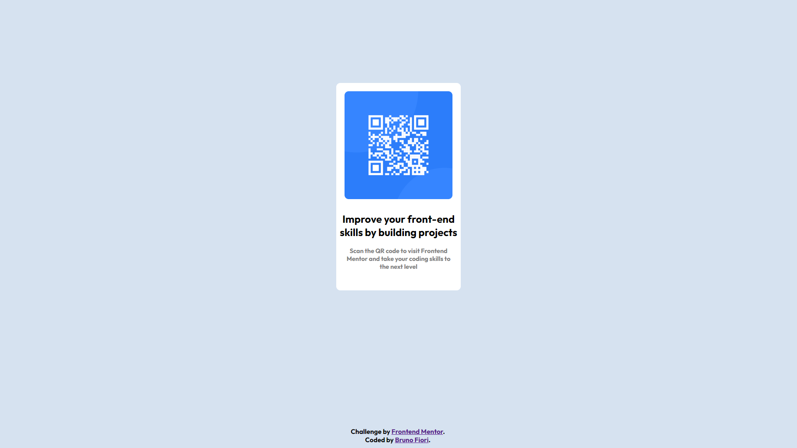

# Frontend Mentor - QR code component solution

This is a solution to the [QR code component challenge on Frontend Mentor](https://www.frontendmentor.io/challenges/qr-code-component-iux_sIO_H) by Bruno Fiori.

## Table of contents

- [Overview](#overview)
- [Screenshot](#screenshot)
- [My process](#my-process)
- [Built with](#built-with)
- [Useful resources](#useful-resources)
- [Author](#author)
- [Acknowledgments](#acknowledgments)

## Overview

### Screenshot

   <!-- Finished desktop version page >

    <!-- Finished mobile verson page >

## My process

-The project was divided into some parts, I started with the background of the page, where a fixed color was requested.

-In the main rectangle, its dimensions were defined and its edges rounded. The hard part was centering it in the middle of the page.

-After positioning the main rectangle, the QR code was placed in the form of an image, with its size defined by HTML and its edges rounded with CSS. Another difficulty was positioning it in front of the rectangle, for which a margin reduction was made at the top.

-In the text part, I imported the 'outfit' font from google and called it into the corresponding DIV, as it was two sentences each division was styled accordingly.

-Finally, I created a footer to promote my github and the challenge website

-The layout, shapes and image(QR), was done through DIV where each was styled accordingly. In the html they were called as respective functions

### Built with

- Semantic HTML5 markup
- CSS custom properties
- CSS Grid
- Google font - Family: [Outfit]

### Useful resources

- [Centering](https://www.w3.org/Style/Examples/007/center.en.html) - My biggest difficulty was centering certain DIV, on this site I was able to research and understand better about.

## Author

- Frontend Mentor - Bruno S Fiori (https://www.frontendmentor.io/profile/BrunoSFiori)
- Github - Bruno S Fiori (https://github.com/BrunoSFiori)

## Acknowledgments

Thanks for reading and following my first HTML CSS project =D
